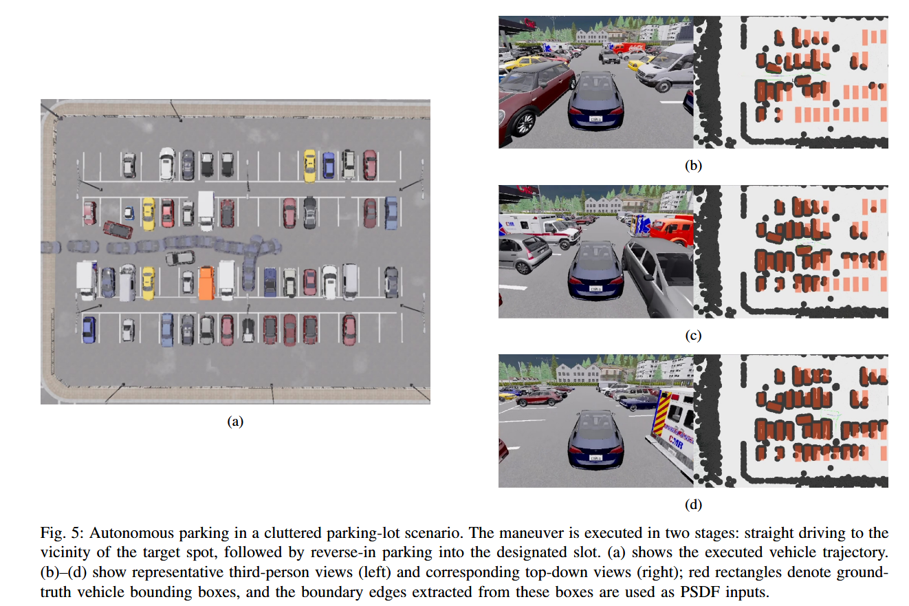
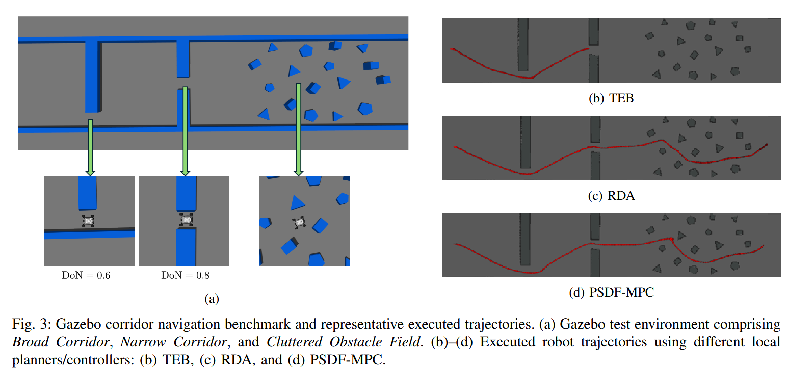

# PSDF-ROS

ROS1 implementation of PSDF-MPC: a GPU-accelerated polygonal signed distance function (PSDF) embedded in a model predictive controller for real-time collision avoidance.

## Paper
- Title: GPU-Accelerated Polygonal Signed Distance Function for Real-Time Collision Avoidance

## Method
PSDF computes geometry-exact signed distances between a convex polygonal robot footprint and obstacle boundary edges, enabling differentiable, high-rate collision constraints. The core computation is a branch-free tensorized pipeline for batched GPU evaluation and automatic differentiation. These constraints are locally linearized inside an SQP-RTI MPC loop with a CPU/GPU split: GPU for PSDF values/gradients and CPU for sparse QP solves independent of obstacle feature count.

## Experiments
### Autonomous Parking (CARLA Simulator)
Ackermann vehicle parking in a cluttered lot. The maneuver is executed in two stages (approach and reverse-in), using PSDF inputs extracted from obstacle boundary edges.



### Narrow Corridor Navigation (Gazebo Simulator)
Corridor navigation in a Gazebo benchmark with narrow passages and cluttered obstacles. PSDF-MPC is evaluated on representative trajectories in constrained environments.



## Requirements
- ROS1 Melodic/Noetic with `nav_core`, `costmap_2d`, `laser_line_extraction`, `costmap_converter`, `ackermann_msgs`, `tf2`, `visualization_msgs`
- Python 3 with PyTorch, CasADi, ACADOS, `l4casadi` available to the ROS environment

## Build
```bash
cd ~/catkin_ws
rosdep install --from-paths src --ignore-src -r -y
catkin_make --pkg psdf_ros
source ~/catkin_ws/devel/setup.bash
```

## Run
Autonomous parking (CARLA):
```bash
roslaunch psdf_ros carla/carla_navigation.launch
```

Narrow corridor navigation (Gazebo):
```bash
roslaunch psdf_ros scout/scout_gazebo.launch
roslaunch psdf_ros scout/test_psdf.launch
```
